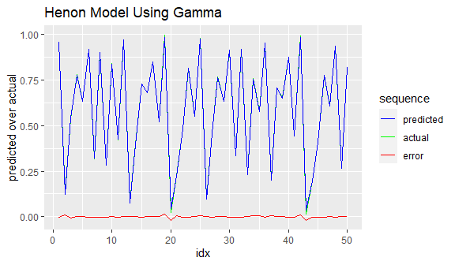

<!-- README.md is generated from README.Rmd. Please edit that file -->

# sr

<!-- badges: start -->
<!-- badges: end -->

Smooth Regression is a set of techniques for finding causal
relationships in precision data. It is built around the Gamma test. If
you have some measurements that might be predictive, and a target that
you want to predict, Gamma estimates the mean squared error of the best
smooth model that could be built on that data. In linear regression, the
intercept coefficient tells you the expected error of the model. Gamma
does this for smooth models as a class. It measures smoothness in a data
relationship. Smoothness is a property of natural causal processes.
Natural processes differ from noise because they are smooth, and noise
is not. Neural networks are smooth models, as are differential equations
whose derivatives don’t become infinite. Gamma is a mathematically
principled answer to the over-training problem in machine learning.

In order to detect smoothness, Gamma needs precision data. For category
and small integer data, you should use traditional methods - traditional
statistics is very good at category problems. Gamma works on continuous
data. In practice this means that values should range across two or more
full digits precision in all of your variables. .

Gamma finds causal relationships including lags and embeddings for time
series models. It can also be used to tune the performance of neural
networks. This package, `sr`, provides the Gamma test along with a
toolkit of search techniques that use it.

## Installation

You can install the development version of sr like so:

``` r
#  devtools::install_github("haythorn/sr")
```

## Example

This example shows the Gamma test used to control the training of a
neural network, to get an optimally accurate model without
over-training. The example shows

- the creation of an embedding on a time series,
- division of the data into training and test subsets,
- calling `gamma_test` to get a target mean squared error,
- training and testing the neural net to that target, and
- displaying the results.

This example is explained in detail in the time_series vignette.

``` r
library(sr)
library(nnet)
library(ggplot2)


x <- embed(as.matrix(hs), 3)   #hs is a time series

target <- x[ ,1]
train_t <- target[1:600]
test_t <-  target[601:998]

predictors <- x[ ,2:3]
train_p <- predictors[1:600, ]
test_p  <- predictors[601:998, ]

# train a neural net, using Gamma to control the training
sum_squares <- gamma_test(train_p, train_t)$Gamma * length(t)

gamma_model <- nnet(x = train_p, y = train_t, size = 8, rang = 0.1,
                decay = 1e-5, maxit = 2000, abstol =  sum_squares)
#> # weights:  33
#> initial  value 54.159156 
#> iter  10 value 25.777399
#> iter  20 value 10.202731
#> iter  30 value 1.513277
#> iter  40 value 0.696258
#> iter  50 value 0.585760
#> iter  60 value 0.523748
#> iter  70 value 0.480959
#> iter  80 value 0.464092
#> iter  90 value 0.456596
#> iter 100 value 0.437996
#> iter 110 value 0.415935
#> iter 120 value 0.402788
#> iter 130 value 0.389723
#> iter 140 value 0.373146
#> iter 150 value 0.324041
#> iter 160 value 0.266485
#> iter 170 value 0.140717
#> iter 180 value 0.123217
#> iter 190 value 0.103518
#> iter 200 value 0.100401
#> iter 210 value 0.090259
#> iter 220 value 0.089919
#> iter 230 value 0.087437
#> iter 240 value 0.086174
#> iter 250 value 0.083583
#> iter 260 value 0.082035
#> iter 270 value 0.079010
#> iter 280 value 0.077078
#> iter 290 value 0.075312
#> iter 300 value 0.074159
#> iter 310 value 0.073701
#> iter 320 value 0.072846
#> iter 330 value 0.069561
#> iter 340 value 0.068833
#> iter 350 value 0.067986
#> iter 360 value 0.067835
#> iter 370 value 0.066838
#> iter 380 value 0.066370
#> iter 390 value 0.065927
#> iter 400 value 0.065506
#> iter 410 value 0.064226
#> iter 420 value 0.063284
#> iter 430 value 0.063107
#> iter 440 value 0.062817
#> iter 450 value 0.062633
#> iter 460 value 0.062368
#> iter 470 value 0.062167
#> iter 480 value 0.061764
#> iter 490 value 0.061709
#> iter 500 value 0.061601
#> iter 510 value 0.061487
#> iter 520 value 0.061430
#> iter 530 value 0.061310
#> iter 540 value 0.061053
#> iter 550 value 0.060431
#> iter 560 value 0.060381
#> iter 570 value 0.060250
#> iter 580 value 0.060087
#> iter 590 value 0.059837
#> iter 600 value 0.059037
#> iter 610 value 0.058452
#> iter 620 value 0.057053
#> iter 630 value 0.057026
#> iter 640 value 0.056967
#> iter 650 value 0.056900
#> iter 660 value 0.056822
#> iter 670 value 0.056703
#> iter 680 value 0.056617
#> iter 690 value 0.056554
#> iter 700 value 0.056518
#> iter 710 value 0.056499
#> iter 720 value 0.056376
#> iter 730 value 0.056333
#> iter 740 value 0.056286
#> iter 750 value 0.056178
#> iter 760 value 0.056098
#> iter 770 value 0.056008
#> iter 780 value 0.055941
#> iter 790 value 0.055906
#> iter 800 value 0.055884
#> iter 810 value 0.055862
#> iter 820 value 0.055838
#> iter 830 value 0.055832
#> iter 840 value 0.055818
#> iter 850 value 0.055806
#> iter 860 value 0.055772
#> iter 870 value 0.055740
#> iter 880 value 0.055682
#> iter 890 value 0.055611
#> iter 900 value 0.055599
#> iter 910 value 0.055590
#> iter 920 value 0.055574
#> iter 930 value 0.055556
#> iter 940 value 0.055518
#> iter 950 value 0.055463
#> iter 960 value 0.055428
#> iter 970 value 0.055401
#> iter 980 value 0.055398
#> iter 990 value 0.055369
#> iter1000 value 0.055346
#> iter1010 value 0.055296
#> iter1020 value 0.055221
#> iter1030 value 0.055214
#> iter1040 value 0.055196
#> iter1050 value 0.055184
#> iter1060 value 0.055171
#> iter1070 value 0.055135
#> iter1080 value 0.055091
#> iter1090 value 0.055008
#> iter1100 value 0.054950
#> iter1110 value 0.054923
#> iter1120 value 0.054884
#> iter1130 value 0.054842
#> iter1140 value 0.054771
#> iter1150 value 0.054556
#> iter1160 value 0.054495
#> iter1170 value 0.054356
#> iter1180 value 0.054275
#> iter1190 value 0.054183
#> iter1200 value 0.053819
#> iter1210 value 0.053191
#> iter1220 value 0.051341
#> iter1230 value 0.051219
#> iter1240 value 0.050959
#> iter1250 value 0.050645
#> iter1260 value 0.050219
#> iter1270 value 0.049415
#> iter1280 value 0.048788
#> iter1290 value 0.048397
#> iter1300 value 0.048136
#> iter1310 value 0.047960
#> iter1320 value 0.047662
#> iter1330 value 0.047347
#> iter1340 value 0.047190
#> iter1350 value 0.046861
#> iter1360 value 0.046788
#> iter1370 value 0.046564
#> iter1380 value 0.046467
#> iter1390 value 0.046312
#> iter1400 value 0.046169
#> iter1410 value 0.046049
#> iter1420 value 0.045867
#> iter1430 value 0.045711
#> iter1440 value 0.045492
#> iter1450 value 0.045173
#> iter1460 value 0.044919
#> iter1470 value 0.044760
#> iter1480 value 0.044612
#> iter1490 value 0.043793
#> iter1500 value 0.043455
#> iter1510 value 0.043044
#> iter1520 value 0.042788
#> iter1530 value 0.042325
#> iter1540 value 0.042182
#> iter1550 value 0.042110
#> iter1560 value 0.041757
#> iter1570 value 0.041727
#> iter1580 value 0.041679
#> iter1590 value 0.041607
#> iter1600 value 0.041506
#> iter1610 value 0.041406
#> iter1620 value 0.041325
#> iter1630 value 0.041319
#> iter1640 value 0.041302
#> iter1650 value 0.041252
#> iter1660 value 0.041229
#> iter1670 value 0.041206
#> iter1680 value 0.041194
#> iter1690 value 0.041185
#> iter1700 value 0.041182
#> iter1710 value 0.041175
#> iter1720 value 0.041163
#> iter1730 value 0.041147
#> iter1740 value 0.041140
#> iter1750 value 0.041130
#> iter1760 value 0.041123
#> iter1770 value 0.041118
#> iter1780 value 0.041112
#> iter1790 value 0.041109
#> iter1800 value 0.041103
#> iter1810 value 0.041094
#> iter1820 value 0.041076
#> iter1830 value 0.041066
#> iter1840 value 0.041056
#> iter1850 value 0.041037
#> iter1860 value 0.041029
#> iter1870 value 0.041019
#> iter1880 value 0.040999
#> iter1890 value 0.040994
#> iter1900 value 0.040988
#> iter1910 value 0.040972
#> iter1920 value 0.040942
#> iter1930 value 0.040929
#> iter1940 value 0.040921
#> iter1950 value 0.040892
#> iter1960 value 0.040885
#> iter1970 value 0.040873
#> iter1980 value 0.040851
#> iter1990 value 0.040839
#> iter2000 value 0.040824
#> final  value 0.040824 
#> stopped after 2000 iterations


# how does the model do on test data?
predicted <- predict(gamma_model, test_p, type = "raw")
test_result <- data.frame(idx = 1:length(test_t), predicted[ ,1], test_t)
colnames(test_result) <- c("idx", "predicted", "actual")

ggplot(data = test_result[1:50, ]) +
  geom_line(mapping = aes(x = idx, y = actual, color = "green")) +
  geom_line(mapping = aes(x = idx, y = predicted, color = "blue")) +
  geom_line(mapping = aes(x = idx, y = actual - predicted, color = "red")) +
  scale_colour_manual(name = 'sequence', 
         values =c('green'='green', 'blue'='blue','red'='red'), 
         labels = c('predicted', 'actual', 'error' )) +
  labs(y = "predicted over actual",
      title = "Henon Model Using Gamma")
```


